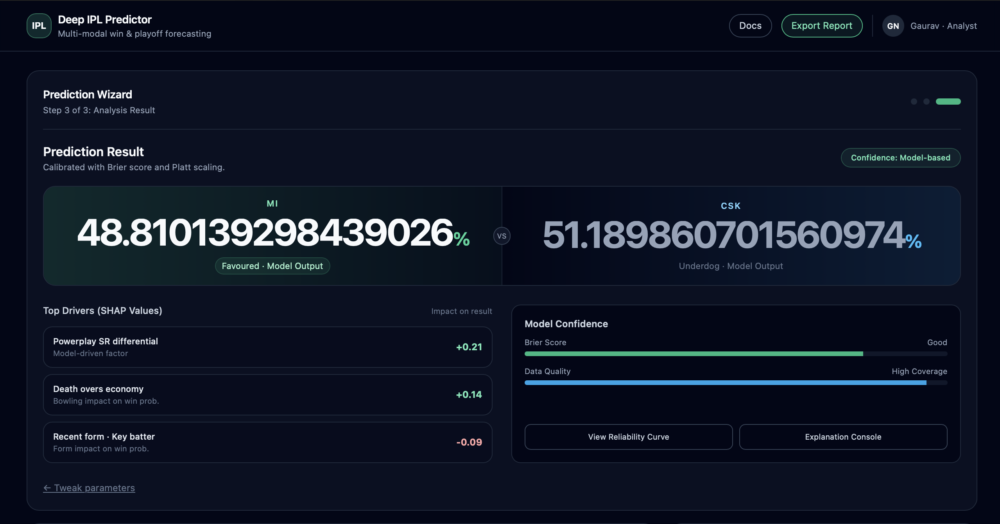

# 🏏 Deep IPL Predictor

### Multi-Modal Win & Playoff Forecasting for the Indian Premier League

[](https://python.org)
[](https://pytorch.org)
[](https://flask.palletsprojects.com)
[]()
[]()
[](LICENSE)

> **CSCI 566 · University of Southern California**  
> Nikhil Ravichandran · Gaurav NV · Atharva Sonawane

---

## Overview

Deep IPL Predictor is a production-grade cricket analytics system that forecasts IPL match outcomes with **80% accuracy** and a **Brier score of 0.24** on the 2025 IPL season. It goes far beyond simple team-level statistics by integrating player-level data from **13 cricket competitions**, learning **phase-specific performance profiles**, and modeling individual **batter–bowler matchup asymmetries** through a Graph Attention Network.

The system combines three complementary engines:

| Engine                             | Role                                           | Accuracy         |
| ---------------------------------- | ---------------------------------------------- | ---------------- |
| **Dynamic OVR Ratings**            | Multi-position player evaluation (55–97 scale) | Foundation       |
| **4-Source Attention Transformer** | Learnable fusion of OVR, H2H, Form, PvP        | 79.7% (val)      |
| **Monte Carlo + GAT**              | 10,000-simulation probabilistic engine         | **80.0% (test)** |

---

## Demo



## Table of Contents

- [Key Features](#key-features)
- [Architecture](#architecture)
- [Results](#results)
- [Project Structure](#project-structure)
- [Setup & Installation](#setup--installation)
- [Running the App](#running-the-app)
- [API Reference](#api-reference)
- [Data Pipeline](#data-pipeline)
- [Dynamic OVR System](#dynamic-ovr-system)
- [Model Details](#model-details)
- [Limitations & Future Work](#limitations--future-work)
- [Citation](#citation)

---

## Key Features

- **Multi-league data integration** — 13 competitions (IPL, T20I, BBL, CPL, PSL, SA20, ILT20, ODI, SMAT, Vijay Hazare, Ranji, Duleep, STATE_T20), 235 players, 3,055 records across 2021–2024 with 98.3% data completeness
- **Dynamic OVR Ratings** — separate ratings for batting positions (Top Order / Middle Order / Finisher) and bowling phases (Powerplay / Middle Overs / Death Overs), with intelligent sparse-data handling
- **GAT-enhanced PvP matchups** — bipartite batter–bowler graph with 2-layer Graph Attention Network learning delta corrections from head-to-head confrontation history
- **4-source weighted attention transformer** — learnable fusion of player OVR embeddings, H2H history, recent form, and PvP matchup advantages
- **Monte Carlo simulation engine** — 10,000+ simulated contests per prediction for calibrated probabilistic output
- **Production Flask API** — under 2-second prediction latency on CPU; production-hardened with `PRODUCTION=YES`
- **SHAP explainability** — feature attributions surfacing powerplay differentials, death-overs economy, and form signals driving each prediction

---

## Architecture

```
┌─────────────────────────────────────────────────────────────┐
│                   13-League Data Pipeline                   │
│  Quality Weights → Recency Decay → Phase Decomposition      │
└────────────────────────┬────────────────────────────────────┘
                         │
              ┌──────────▼──────────┐
              │   Dynamic OVR       │
              │  (55–97 scale)      │
              │ BAT: TOP/MID/FIN    │
              │ BWL: PP/MID/DEATH   │
              └──────┬──────┬───────┘
                     │      │
       ┌─────────────┘      └──────────────────┐
       │                                        │
┌──────▼──────────────────────────────────┐    │
│     4-Source Weighted Attention          │    │
│     Transformer                          │    │
│  ┌──────────┐ ┌─────┐ ┌──────┐ ┌─────┐ │    │
│  │ OVR Emb  │ │ H2H │ │ Form │ │ PvP │ │    │
│  │(23% wt)  │ │(27%)│ │(25%) │ │(26%)│ │    │
│  └────┬─────┘ └──┬──┘ └──┬───┘ └──┬──┘ │    │
│       └──────────┴────────┴────────┘    │    │
│              Learnable Fusion            │    │
│           144-dim → MLP → sigmoid        │    │
└──────────────────────────────────────────┘    │
                                                 │
              ┌──────────────────────────────────┘
              │   GAT (2 layers, 4 heads)
              │   Batter–Bowler Bipartite Graph
              │   Delta Correction Scores
              └──────────┐
                         │
              ┌──────────▼──────────┐
              │  Monte Carlo Engine  │
              │   10,000+ sims/match │
              │  Win Probability     │
              └─────────────────────┘
```

---

## Results

### Model Comparison

| Model                        | Validation (2024 IPL, 74 matches) | Test (2025 IPL, 20 matches) |
| ---------------------------- | --------------------------------- | --------------------------- |
| Random Forest + XGBoost      | 57.67%                            | —                           |
| Temporal Fusion Transformer  | 62.16%                            | —                           |
| Monte Carlo Simulation       | 75.68%                            | 75.00%                      |
| **Monte Carlo + GAT (Ours)** | **79.73%**                        | **80.00%**                  |

### Calibration

| Metric              | Value       |
| ------------------- | ----------- |
| Average Brier Score | **0.240**   |
| Random baseline     | 0.250       |
| Brier range         | 0.09 – 0.40 |
| True Positive Rate  | 81.8%       |
| True Negative Rate  | 78.2%       |

### Learned Source Weights

```
Head-to-Head History    ████████████████████████████  27%
Player vs Player        ███████████████████████████   26%
Recent Form (Last 5/10) ██████████████████████████    25%
Player OVR Ratings      ████████████████████████      23%
```

The model automatically discovers near-equal weights, confirming all four information sources contribute meaningfully to prediction quality.

---

## Project Structure

```
deep-ipl-predictor/
├── app.py                          # Production Flask API
├── requirements.txt
├── .env.example
│
├── data_forge/
│   └── dataset/
│       ├── OVR/
│       │   ├── PRE_OVR_BATTING_*.csv       # Batting OVR scores (55–97)
│       │   └── PRE_OVR_BOWLING_*.csv       # Bowling OVR scores (55–97)
│       │
│       └── DL_MODELS/
│           ├── ipl_match_predictor.py      # Predictor, PlayerLookup, norm_team
│           ├── best_model.pt               # Trained transformer weights
│           └── outputs/
│               ├── team_h2h_matrix_2025.csv
│               ├── team_recent_form_2025.csv
│               └── pvp_nested_dict.json    # GAT-learned PvP embeddings
│
└── templates/
    └── index.html                  # Prediction wizard UI
```

---

## Setup & Installation

### Prerequisites

- Python 3.9+
- pip

### 1. Clone the repository

```bash
git clone https://github.com/<your-org>/deep-ipl-predictor.git
cd deep-ipl-predictor
```

### 2. Create a virtual environment

```bash
python -m venv venv
source venv/bin/activate        # Windows: venv\Scripts\activate
```

### 3. Install dependencies

```bash
pip install -r requirements.txt
```

### 4. Configure environment

```bash
cp .env.example .env
# Edit .env as needed
```

`.env.example`:

```env
PORT=5000
PRODUCTION=NO    # Set to YES for production deployments
```

---

## Running the App

### Development

```bash
python app.py
# Server starts at http://localhost:5000
```

### Production

```bash
# Option A — via environment variable (uses waitress automatically)
PRODUCTION=YES python app.py

# Option B — recommended: use gunicorn
PRODUCTION=YES gunicorn -w 4 -b 0.0.0.0:5000 app:app

# Option C — Docker
docker build -t deep-ipl-predictor .
docker run -e PRODUCTION=YES -p 5000:5000 deep-ipl-predictor
```

> When `PRODUCTION=YES`, the app switches to WARNING-level logging, suppresses internal stack traces from API responses, disables Flask's debug mode, and uses a production WSGI server.

---

## API Reference

### `GET /health`

Returns service health status.

```json
{ "status": "ok", "production": false }
```

---

### `GET /api/teams`

Returns all available IPL teams and their home grounds.

```json
{
  "teams": ["CSK", "DC", "GT", ...],
  "grounds": {
    "CSK": { "home_grounds": ["MA Chidambaram Stadium, Chennai"] },
    ...
  }
}
```

---

### `GET /api/players/<team>`

Returns all players for a team with their OVR ratings.

```bash
GET /api/players/CSK
```

```json
{
  "success": true,
  "team": "CSK",
  "count": 25,
  "players": [
    {
      "name": "MS Dhoni",
      "category": "WK-BATTER",
      "bat_ovr": 88.4,
      "bowl_ovr": null,
      "overall_ovr": 88.4,
      "top_ovr": null,
      "middle_ovr": 85.1,
      "finisher_ovr": 91.2,
      "pp_ovr": null,
      "death_ovr": null
    }
  ]
}
```

---

### `GET /api/search_players?q=<query>`

Search for players across all teams (min 2 characters). Returns up to 20 results.

---

### `POST /api/predict`

Run a match prediction.

**Request body:**

```json
{
  "team1": "CSK",
  "team2": "MI",
  "team1_players": [
    { "Player_Name": "MS Dhoni", "Player_Type": "WK-Batsman" },
    ...
  ],
  "team2_players": [
    { "Player_Name": "Rohit Sharma", "Player_Type": "Batsman" },
    ...
  ]
}
```

**Response:**

```json
{
  "success": true,
  "winner": "CSK",
  "team1_prob": 58.34,
  "team2_prob": 41.66,
  "winner_prob": 58.34,
  "confidence": {
    "level": "MEDIUM",
    "margin": 16.68,
    "color": "#f59e0b"
  },
  "source_weights": {
    "ovr": 23.0,
    "h2h": 27.0,
    "form": 25.0,
    "pvp": 26.0
  },
  "context": {
    "h2h": { "exists": true, "team1_wins": 18, "team2_wins": 16, "total": 34 },
    "form": {
      "team1": { "exists": true, "last_5_wins": 3, "win_rate": 60.0 },
      "team2": { "exists": true, "last_5_wins": 2, "win_rate": 40.0 }
    }
  }
}
```

Confidence levels: `HIGH` (margin ≥ 25%), `MEDIUM` (≥ 10%), `LOW` (< 10%).

---

## Data Pipeline

Player statistics are aggregated from 13 competitions using two correction factors applied before any metric enters the model:

**League quality weights:**
| Competition | Weight |
|---|---|
| IPL, T20I | 1.0 |
| BBL, SA20 | 0.9 |
| CPL, ILT20 | 0.8 |
| SMAT, Vijay Hazare | 0.6–0.7 |

**Recency decay:**
| Season | Weight |
|---|---|
| 2024 | 1.00 |
| 2023 | 0.75 |
| 2022 | 0.50 |
| 2021 | 0.25 |

All statistics are then decomposed into **three match phases**: Powerplay (overs 1–6), Middle Overs (7–15), and Death Overs (16–20).

---

## Dynamic OVR System

Players receive ratings on a **55–97 scale** with separate scores for each role they can fill.

### Batting (≥ 15 innings)

```
BASE_OVR = 0.30 × Strike Rate
         + 0.20 × Average
         + 0.15 × Boundary %
         + 0.15 × Conversion Rate
         + 0.10 × Rotation SR
         + 0.10 × Volume/Consistency
         + Bonuses (experience, match-winner, explosive, debut)
```

Position-specific OVRs (TOP / MIDDLE / FINISHER) re-weight these components toward phase-relevant metrics. For sparse data (< 15 innings), weights shift automatically toward Strike Rate (+10%) and Boundary % (+10%), skipping conversion and consistency entirely.

### Bowling (≥ 10 innings)

```
BASE_OVR_initial = 0.35 × Economy
                 + 0.18 × Dot Ball %
                 + 0.15 × Average
                 + 0.14 × Strike Rate
                 + 0.10 × Consistency
                 + 0.08 × Control
                 + Bonuses + 7 (IPL T20 buff)

BASE_OVR_final = avg(top 2 phase OVRs)  ← prevents over-inflation
```

### Special adjustments

- Debut batters: ×0.93 (−7% before bonuses)
- Wicketkeeper-batters: +3.5 to highest position OVR
- Captains: +2 to BASE_OVR and highest position OVR
- Debut bowlers: +0 to +3 bonus for low economy (no nerf)

---

## Model Details

### Graph Attention Network (PvP)

For each batter–bowler pair with ≥ 5 historical encounters, a 2-layer GAT (4 attention heads) learns **delta corrections** — relational advantage scores that adjust base expectations for specific matchups. These are averaged across all 121 possible pairs (11 × 11) in a playing XI to produce two features fed to the transformer: average advantage score ∈ [−1, +1] and coverage ratio.

### Transformer Architecture

```
Input: 32-dim player embeddings (4 dims from OVR, 28 learned)
       ↓
2-head self-attention over 11-player XI → team embedding
       ↓
4 parallel context encoders:
  Team Strength:  Linear(32→64) → LayerNorm → ReLU → Dropout(0.2)
  H2H History:    Linear(4→32)  → ReLU → Dropout(0.2)
  Recent Form:    Linear(7→32)  → ReLU → Dropout(0.2)
  PvP Matchups:   Linear(2→16)  → ReLU → Dropout(0.2)
       ↓
Learnable softmax fusion → 144-dim concatenation
       ↓
Prediction head: 144→64→32→1 (sigmoid)
```

**Training:** Adam (lr=1e-3), batch size 16, 50 epochs, early stopping (patience 10), dropout 0.2, weight decay 1e-4. Train: 2022–2023 IPL. Val: 2024 IPL (74 matches). Test: 2025 IPL first 20 matches.

---

## Limitations & Future Work

**Current limitations identified from error analysis:**

- **Environmental factors** — 1 of 4 test errors occurred in a dew-affected evening match where bowling economy degraded ~2.1 runs/over beyond historical baseline. Venue-specific weather integration is not yet modeled.
- **Ultra-short form windows** — Hot streaks over 2–3 matches are not always captured by the current weighted aggregation scheme.
- **Close matches** — 2 of 4 errors were in matches decided by < 10 runs; Brier scores are appropriately elevated (0.30–0.40) for these.

**Planned improvements:**

- [ ] Real-time form weighting (last 3 matches weighted higher)
- [ ] Weather API integration for dew likelihood and pitch moisture
- [ ] Live ball-by-ball probability updates during match progression
- [ ] Multi-league expansion for cross-competition player valuation (BBL, CPL, SA20, ILT20)
- [ ] Auction optimization module for franchise draft strategy
- [ ] Extension to ODI and T20I formats

---

## Citation

If you use this work in your research, please cite:

```bibtex
@article{ravichandran2025deepipl,
  title     = {Deep Learning for IPL Match Outcome and Playoff Prediction:
               A Multi-Modal Approach Using Dynamic Player Ratings and Environmental Factors},
  author    = {Ravichandran, Nikhil and NV, Gaurav and Sonawane, Atharva},
  institution = {University of Southern California},
  year      = {2025},
  note      = {CSCI 566 Final Project}
}
```

---

## Acknowledgements

Data sourced from [ESPNcricinfo](https://www.espncricinfo.com), [IPL Official Stats](https://www.iplt20.com/stats), [BCCI Domestic Hub](https://www.bcci.tv), [Cricket Australia / BBL](https://www.bigbash.com.au), [CPL T20](https://www.cplt20.com), [SA20](https://www.sa20.co.za), and [ILT20](https://www.ilt20.ae).

Framework built with [PyTorch](https://pytorch.org), [Flask](https://flask.palletsprojects.com), and [pandas](https://pandas.pydata.org).

---

_Built at USC · CSCI 566 Deep Learning · Spring 2025_
